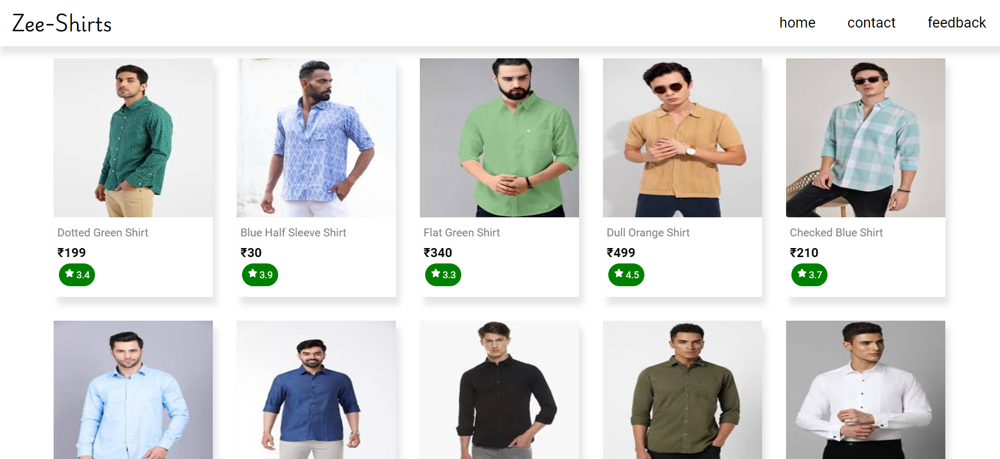

# E-commerce Site

An e-commerce platform(Zee shirts) built with React, Node.js, Express.js and Razorpay.

## 🚀 Features

- 🛍️ Product listing and filtering
- 🛒 Shopping cart functionality
- 💳 Razorpay integration for payments
- 📱 Responsive design for mobile and desktop

## 📸 Sample image



## 🛠️ Technologies Used

  
 
 
    
- 
- ## 📊 Language & Repo Stats


 
## 📦 Installation

To get the project running on your local machine:

```bash
git clone https://github.com/yourusername/ecommerce-site.git
cd projectG
npm install
cd client
npm install
npm run dev
cd server
npm init -y
npm i express mongoose razorpay 
npm run dev
```
